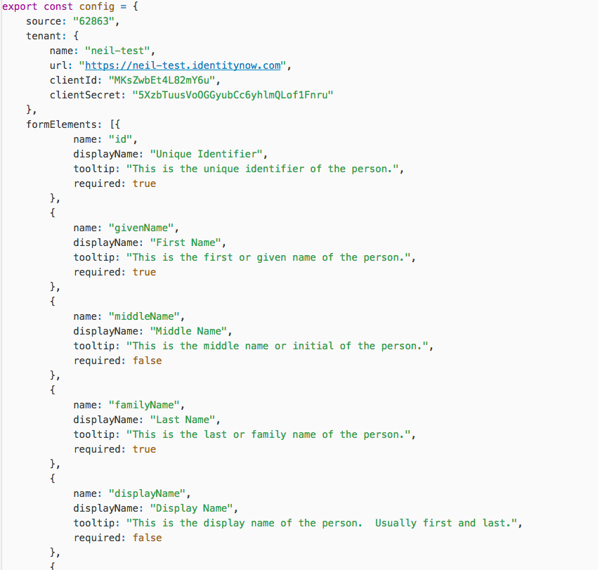
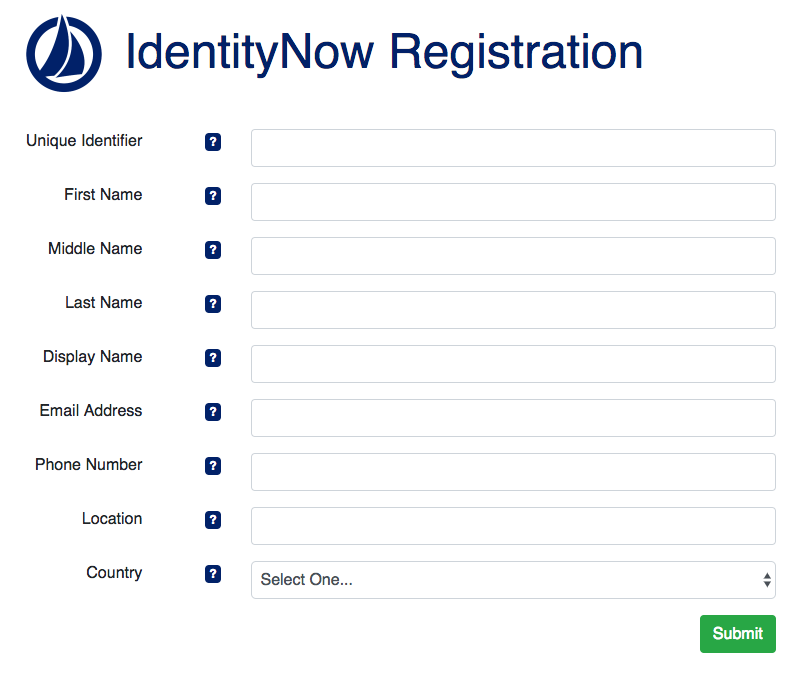

# IdentityNow Registration

Author: [Neil McGlennon](mailto:neil.mcglennon@sailpoint.com)

## Overview

This is a simple IdentityNow registration page written in [Node.js](https://nodejs.org/en/), [React](), and [Bootstrap]().  The purpose of this is to have an example form which can create identities into IdentityNow via REST APIs.  While this isn't intended for actual Production usage, it can be used as a basis for registration pages.

## Configuration

Overall the configuration for this is fairly easy, and contained in a single `config.js` file, which looks like this:

~~~
export const config = {
    source: "62863",
    title: "IdentityNow Registration",
    tenant: {
        name: "neil-test",
        url: "https://neil-test.identitynow.com",
        clientId: "MKs...Y6u",
        clientSecret: "5Xz...nru"
    },
    formElements: [{
            name: "id",
            displayName: "Unique Identifier",
            tooltip: "This is the unique identifier of the person.",
            required: true,
            type: "string"
        },
			...
        {
            name: "country",
            displayName: "Country",
            tooltip: "This is the person's country.",
            required: false,
            type: "list",
            options: [
              {
                label: 'United States of America',
                value: 'US'
              }, {
                label: 'United Kingdom',
                value: 'UK'
              },{
                label: 'Germany',
                value: 'DE'
              }
            ]
        }
    ]
};

export default config;
~~~

- **source** - This is the ID of the source which the account creations would show up as.
- **title** - This is the title of the registration page.
- **tenant** - This is the configuration information of the tenant which is being called.
- **formElements** - These are configurations for the various form fields.  These are made up of:
  - **name** - This is the technical account attribute name which will be submitted via the REST API.
  - **displayName** - This is the nice display name which is shown on the registration page.
  - **tooltip** - This is the tooltip 
  - **type** - Can be `string` or `list`.  If this is a `list` then also be sure to include `options` as well.
  - **options** - Used for a `list` of all available options in a drop down menu.

Here is an example of one configured:

## Running

In order to run this, make sure you have [Node.js](https://nodejs.org/en/) installed.

From the `identitynow-registration` folder, run:

~~~
$ npm start
~~~

Once this runs, you should see a startup that looks something like this:

~~~
> identitynow-registration@1.0.0 start /Users/neil.mcglennon/Documents/Workspace/identitynow-services-tools/identitynow-registration
> react-scripts start
Compiled successfully!

You can now view identitynow-registration in the browser.

  Local:            http://localhost:3000/
  On Your Network:  http://172.16.52.46:3000/

Note that the development build is not optimized.
To create a production build, use npm run build.
~~~

Once this is complete, you can go to the URL, and you should be able to see the login page.

 

From here you can fill out the form and submit it:

 

If configured correctly, this should show up in IdentityNow as if you aggregated it:

Enjoy!

## Questions / Issues

If you have any questions, feel free to contact [Neil McGlennon](mailto:neil.mcglennon@sailpoint.com). 

